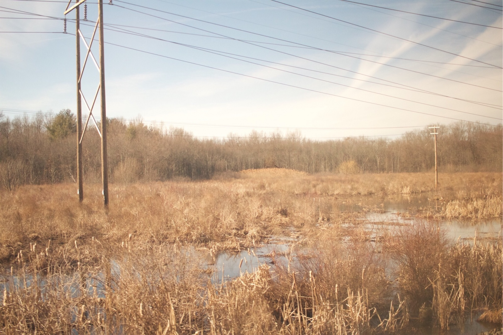

---
# You don't need to edit this file, it's empty on purpose.
# Edit theme's home layout instead if you wanna make some changes
# See: https://jekyllrb.com/docs/themes/#overriding-theme-defaults
layout: default
title:
---

  Quinn Leong
  /
  梁青昆, software engineer & artist

Send a missive: [linkedin][linkedin] / [email][email] – dim sum invitations especially welcome.

✌🏼

[twitter]: https://twitter.com/q__leong
[linkedin]: https://linkedin.com/in/quinnleong
[email]: mailto:leongchengkwan@gmail.com
